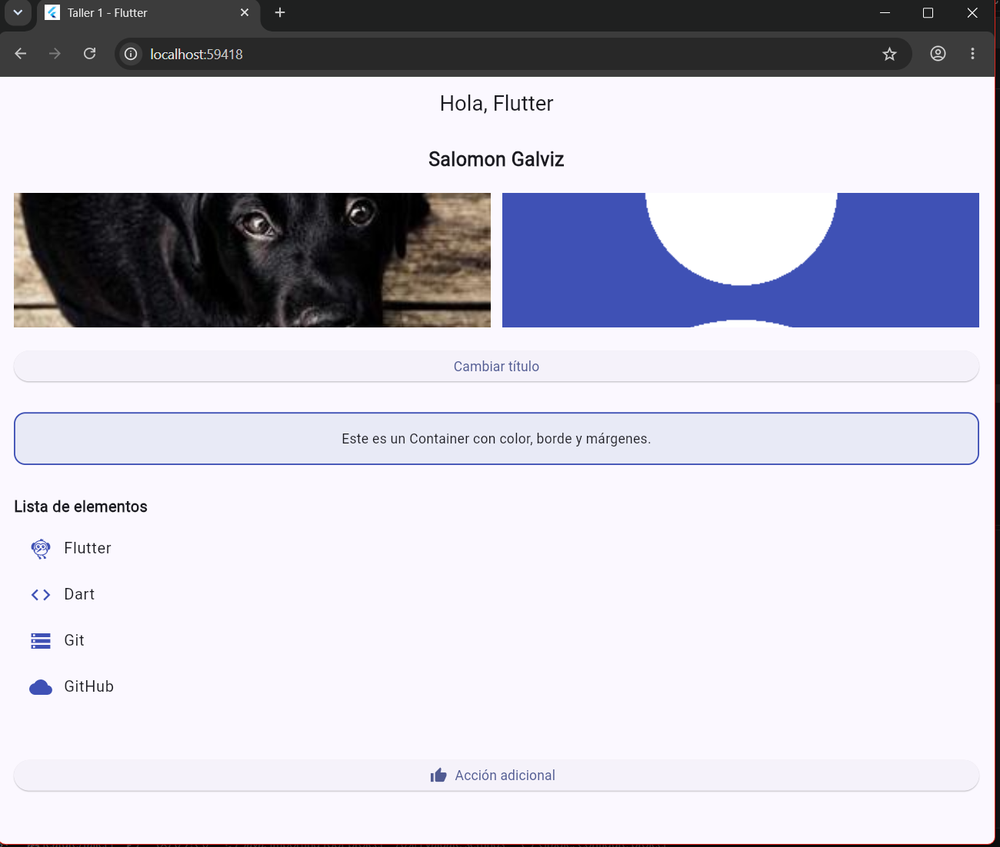
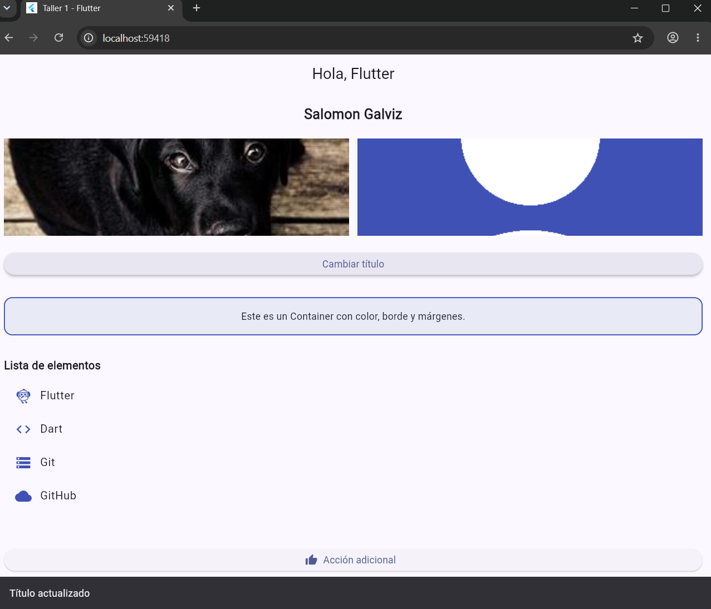
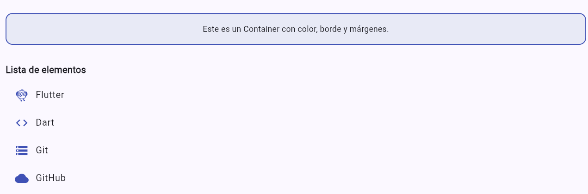
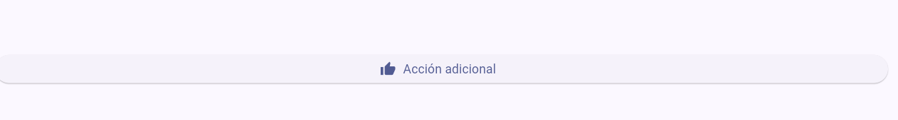

# Taller 1 – Flutter: StatefulWidget y setState()

**Estudiante:** Salomon Galviz
**Código:** 230232004
**Asignatura:** Electiva Profesional 1

## Descripción

Pantalla básica en Flutter (`HomePage`) construida con `StatefulWidget`. Un `ElevatedButton`
alterna el título de la `AppBar` entre "Hola, Flutter" y "¡Título cambiado!" usando `setState()`
y muestra un `SnackBar` con el mensaje "Título actualizado". Incluye imágenes con
`Image.network()` e `Image.asset()` en un `Row`, y los widgets adicionales `Container`,
`ListView` y `ElevatedButton.icon`.

El trabajo se realizó con Git Flow simplificado: rama `feature/taller1` (creada desde `dev`),
Pull Request a `dev` y posterior integración de `dev` a `main`.

## Pasos para ejecutar

```bash
git clone https://github.com/salomongalviz01-coder/taller_flutter.git
cd NOMBRE_DEL_REPO
git checkout feature/taller1
flutter pub get
flutter run
```

## Capturas

**Estado inicial**



**Título cambiado**



**SnackBar**


**Container y ListView**



**ElevatedButton.icon**



## Ramas

- `main`: rama estable
- `dev`: rama de desarrollo
- `feature/taller1`: cambios de este taller
